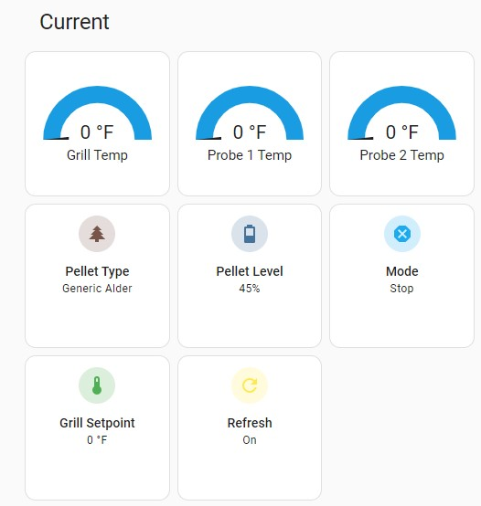
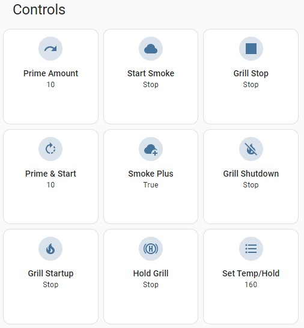

# Frontend Example
The goal is to eventually have a custom lovelace card to display the sensor's information. In the meantime, a makeshift scoreboard can be created using template sensors. Follow the steps below to get a result similar to this:

## Current Info:

 

Configuration for Current Card
```
### Gauge Cluster
square: true
columns: 3
type: grid
title: Current
cards:
  - type: gauge
    entity: sensor.grill_temp
    needle: true
    min: 0
    max: 500
  - type: gauge
    entity: sensor.probe1_temp
    needle: true
    min: 0
    max: 250
  - type: gauge
    entity: sensor.probe2_temp
    needle: true
    min: 0
    max: 250
   
### Current Info Cluster
square: true
type: grid
cards:
  - type: tile
    entity: sensor.pellets
    vertical: true
    color: brown
  - type: tile
    entity: sensor.pelletlevel
    vertical: true
  - type: tile
    entity: sensor.pifire_mode
    show_entity_picture: false
    vertical: true
    icon: ''
    name: Mode
    color: primary
  - type: tile
    entity: sensor.grill_setpoint
    show_entity_picture: false
    vertical: true
    name: Grill Setpoint
    color: green
  - type: tile
    entity: automation.update_grill_when_on
    vertical: true
    icon: mdi:refresh
    color: yellow
    icon_tap_action:
      action: call-service
      service: automation.trigger
      data: {}
      target:
        entity_id: automation.update_grill_when_on
    name: Refresh
```

## Control Board:

 

Configuration for Control Card
```
### Control Cluster
square: true
type: grid
title: Controls
cards:
  - type: tile
    entity: input_select.prime_amount
    vertical: true
    tap_action:
      action: call-service
      service: input_select.select_next
      data: {}
      target:
        entity_id: input_select.prime_amount
    icon_tap_action:
      action: call-service
      service: rest_command.grillprimeonly
      data: {}
      target: {}
  - type: tile
    vertical: true
    entity: sensor.pifire_mode
    name: Start Smoke
    icon: mdi:cloud
    icon_tap_action:
      action: call-service
      service: rest_command.grillsmoke
      data: {}
      target: {}
  - type: tile
    entity: sensor.pifire_mode
    vertical: true
    icon_tap_action:
      action: call-service
      service: rest_command.grillstop
      data: {}
      target: {}
    name: Grill Stop
    icon: mdi:square
  - type: tile
    entity: input_select.prime_amount
    vertical: true
    name: Prime & Start
    tap_action:
      action: call-service
      service: input_select.select_next
      data: {}
      target:
        entity_id: input_select.prime_amount
    icon_tap_action:
      action: call-service
      service: rest_command.grillprimeandstartup
      data: {}
      target: {}
    icon: mdi:rotate-right
  - type: tile
    entity: sensor.smoke_plus
    icon_tap_action:
      action: call-service
      service: rest_command.startsmokeplus
      data: {}
      target: {}
    show_entity_picture: false
    vertical: true
    tap_action:
      action: call-service
      service: rest_command.stopsmokeplus
      data: {}
      target: {}
  - type: tile
    entity: sensor.pifire_mode
    vertical: true
    name: Grill Shutdown
    icon: mdi:fire-off
    icon_tap_action:
      action: call-service
      service: rest_command.grillshutdown
      data: {}
      target: {}
  - type: tile
    entity: sensor.pifire_mode
    vertical: true
    name: Grill Startup
    icon_tap_action:
      action: call-service
      service: rest_command.grillstartup
      data: {}
      target: {}
    icon: mdi:fire
    show_entity_picture: false
    tap_action:
      action: more-info
  - type: tile
    entity: sensor.pifire_mode
    vertical: true
    name: Hold Grill
    icon: mdi:car-brake-hold
    icon_tap_action:
      action: call-service
      service: rest_command.grillholdtemp
      data: {}
      target: {}
  - type: tile
    entity: input_select.grill_temp_setpoint
    vertical: true
    name: ' Set Temp/Hold'
    icon_tap_action:
      action: call-service
      service: rest_command.grillsettemp
      data: {}
      target: {}
    tap_action:
      action: call-service
      service: input_select.select_next
      data: {}
      target:
        entity_id: input_select.grill_temp_setpoint
```
